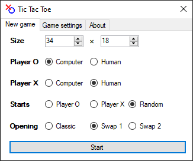
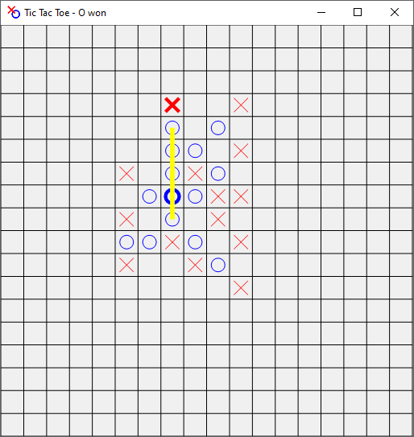

# Tic Tac Toe
In this game players take turns placing two different symbols **X**, **O** on a grid. The first one to create a (diagonal or ortogonal) run of 5 consisting of his symbol wins. The grid can be set to any size. Two human players can play against each other, player can play against a computer, or a computer match can be observed. I created this back in 2015.

## GUI
The user interface is very straightforward, one window for game settings:  
  
and then one for the game board itself:  
  
There's czech and english localisation available.

## Openings
Since the standard opening is not fair, there exists these alternatives:

**SWAP1**: First player makes the first 3 moves. The other player then chooses wich symbols he prefers to play with.  
**SWAP2**: First player makes the first 3 moves. The other player either chooses which symbols he prefers, or places another two symbols and lets the first player choose which symbols he prefers.

## Algorithm
This program doesn't use any usual algorithms for zero sum games like minimax. That is, it's not calculating any possible moves in the future.
Instead it uses a very basic method of assigning a score to each square based just on the current state of the grid.

To do so it considers all quintuplets that are passing through that square and counts how many its own and how many enemy symbols it contains.
According to those amounts it assigns a score to the quintuplet. Overall score of a square is just the the socres of each quituple running trough it.
Out of the squares with the same score, the algorithm chooses randomly.
The scores look something like this

| Number of symbols | 0 | 1 | 2  | 3    | 4      |
|-------------------|---|---|----|------|--------|
| Own               | 1 | 2 | 10 | 200  | 10000  |
| Enemy             | 1 | 4 | 50 | 1000 | 585858 |

For example, when a square lies on a quintuple with 4 enemy symbols, it's getting a very high score and pretty much guaranteed to be chosen as the move, unless there's quintuple containing 4 of its own symbols, which overrides that.  
Multiplying the second row one can set the algorithm to be extra defensive.

This algorithm works suprasingly well. I would like to credit the person whose article I got the ideafrom, but unfortunately I don't remember the source.